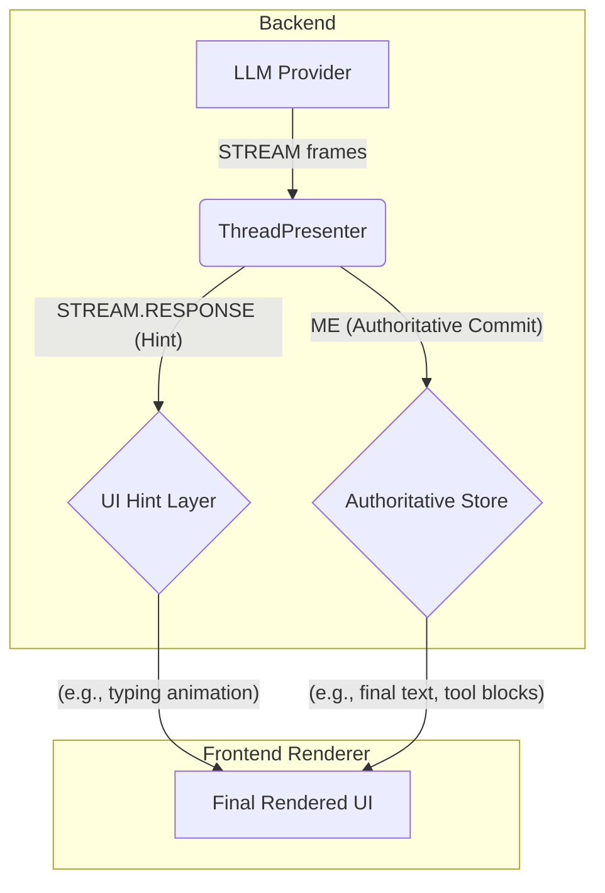
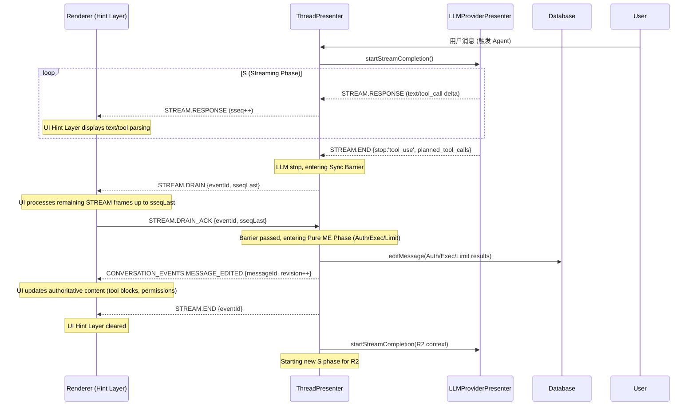

# 核心概念与原则 (Core Concepts & Principles)

**受众：** 开发者、架构师、QA、产品经理

**指导原则：** 本文档旨在建立 DeepChat Agent 项目的统一语言、权威口径和 foundational 行为规范。它提供了核心术语的清晰定义、指导性架构原则以及应避免的反模式，是理解 DeepChat Agent 内部工作机制、进行功能实现与验收、以及排查问题的稳定锚点。

---

## I. 核心术语（Core Terminology）

以下是 DeepChat Agent 领域内关键概念的统一解释，它们共同构成了我们系统的语义基础。

### 1. 交互的层级 (The Hierarchy of Interaction)

*   **Conversation / Session (会话)**
    **定义：** 一个长期存在的上下文容器，承载用户与 DeepChat Agent 之间多次交互轮次 (Turn) 的完整历史。在 DeepChat 中，一个会话由应用层维护，包含所有消息、工具定义、权限配置等持久化信息。

*   **Turn (交互轮次)**
    **定义：** 从用户发起一个新查询开始，到 Agent 产出最终答复为止的完整闭环。一个 Turn 可能包含零到多次工具调用及其结果回传，是 DeepChat Agent 的基本交互单位。其结束信号通常是 LLM 的 `stop_reason='complete'` 或用户主动终止。

*   **Step = (R, S) (推理步骤)**
    **定义：** 在一个 Turn 内部，Agent 的一次“思考 → 响应”的微循环。一个 Turn 由若干 Step 串联而成。
    *   **R (Model Input / 模型输入)：** 本步骤模型可见的全部上下文，包括用户文本、历史摘要、工具结果等。
    *   **S (Model Output / 模型输出)：** 模型给出的文本增量、**工具调用请求 (tool call)** 或最终答复。

*   **X (Tool Execution / 工具执行)**
    **定义：** 模型之外的外部动作，例如调用 API、执行 Shell 命令等。它不属于 Step 本身，而是连接上一个 Step 的 S (模型输出) 到下一个 Step 的 R (模型输入) 的桥梁。在 DeepChat 中，所有工具执行均由 `ThreadPresenter` 统一调度。

### 2. 关键标识符 (The Key Identifiers)

*   **`eventId` (事件 ID)**
    **定义：** 当前助手消息的唯一标识符。在 DeepChat 中，`eventId` 即助手消息的 `messageId`。它在整个 Turn 期间保持不变，作为日志聚合、状态管理和 UI 更新的主键，确保所有相关的 STREAM 和 ME 事件都能关联到同一条消息。

*   **`tool_call_id` (工具调用 ID)**
    **定义：** 唯一标识一个工具调用请求的字符串。这是 DeepChat Agent 中所有与工具调用相关的操作（权限、执行、结果回传、R2 上下文注入）都严格以此 ID 进行**`id-only` 配对**的基石，是确保流程正确性和状态一致性的关键。

### 3. 通信的双重性 (The Duality of Communication)

*   **STREAM (流式提示事件通道)**
    **定义：** LLM Provider 向 UI 实时、增量发送事件的通道。它仅用于提供**临时性 UI 提示**（Hints），如文本打字机效果、工具参数解析过程、运行动画等。STREAM 事件是“阅后即焚”的，**不得**修改持久化内容或定义最终状态，并在 `STREAM.END` 事件后被清理。

*   **ME (Authoritative Commit / 权威提交)**
    **定义：** `CONVERSATION_EVENTS.MESSAGE_EDITED` 事件，用于通知 UI 消息的权威持久化状态已变更。它是 UI 消息内容的**唯一权威更新来源**。所有持久化内容（如最终文本、工具执行结果、权限块、搜索结果等）都必须通过 ME 事件传递，且携带单调递增的 `revision`，以确保状态的最终一致性。

### 4. 状态与规划指标 (State and Planning Indicators)

*   **`stop_reason` (停机原因)**
    **定义：** LLM 指示其停止生成响应的原因。在 DeepChat 中，`'tool_use'` 是最重要的信号，它标志着 S 阶段的结束和**阶段性同步的开始**。`'complete'` 则表示当前 Turn 已自然结束。

*   **`phaseIndex` (相位索引)**
    **定义：** 在一个 Turn 内部，当前推理步骤的 0-based 序号。它主要用于 `IO LOG` 中标识每个 Step，便于回溯和调试。Step N 对应于 `phaseIndex + 1`。

*   **`planned_tool_calls` (计划工具调用)**
    **定义：** 在某一相位（通常是 `stop_reason='tool_use'`）结束时，由 LLM Provider 解析并收敛的工具调用请求列表。它仅作为 Provider 的输出，记录在 `END` 事件载荷和 `IO LOG` 中，以支持“仅收集”模式。

### 5. DeepChat 特定流程概念 (DeepChat-Specific Flow Concepts)

*   **R-prepare (R 阶段预处理)**
    **定义：** R 阶段（LLM 输入）的前置迷你流程，目前特指**搜索功能**。其目的是在向模型提交最终 R 输入前，通过外部检索增强上下文。搜索过程不触发 STREAM，其结果和状态更新通过多次 ME 权威提交。

*   **R2 (继续作答)**
    **定义：** Agent 在执行完工具后，将工具结果回放（注入）到上下文，再次向 LLM 发起请求以生成后续响应的步骤。这属于一个新的 Step 和一个新的 STREAM 流，是实现多步任务、保障对话连续性的关键。

---

## II. 核心架构原则（Foundational Architectural Principles）

这些原则是 DeepChat Agent 设计的基石，指导着所有模块的实现和交互。

### A. 单一真理来源 (Single Source of Truth, SSoT) {#principle-ssot}

**目的：** 消除 UI 状态不一致、竞态条件和闪烁问题，确保 UI 始终反映系统最权威、最稳定的状态。

**深层含义：** UI 层的任何持久化内容（文本、工具块、权限块、搜索块等）都只能由一个且唯一的权威源驱动。

**实现机制：**
*   **UI 权威更新：** 仅来自 `CONVERSATION_EVENTS.MESSAGE_EDITED` 事件。
*   **版本控制：** `MESSAGE_EDITED` 事件**必须**携带单调递增的 `revision` 字段。UI 层**只接受**更高 `revision` 的更新，低版本更新将被丢弃，从而防止乱序和状态回退。
*   **STREAM 的角色：** `STREAM_EVENTS`（START/RESPONSE/DRAIN/END/ERROR） 仅用于提示层（Hint Layer），**不得**修改持久化内容或定义最终态。

#### **Mermaid 流程图 (单一真理来源)**

### B. 阶段性同步 (Phased Synchronization) {#principle-phased-sync}

**目的：** 确保复杂 Agent 工作流中的有序进展，尤其是在 LLM 流式输出与后续的工具执行、权限处理等业务逻辑之间建立明确的同步点。

**深层含义：** 将 LLM 响应的 `stop_reason='tool_use'` 视为一个硬性业务边界和技术同步点，我们称之为**同步屏障 (Synchronization Barrier)**。

**实现机制：**
1.  **`DRAIN` 请求：** 当 TP 收到 `stop_reason='tool_use'` 后，立即向 UI 发送 `STREAM.DRAIN { eventId, sseqLast }`，要求 UI 在处理完所有 `sseqLast` 之前的 STREAM 帧后进行确认。
2.  **`DRAIN_ACK` 确认：** UI 处理完所有 STREAM 帧后，回传 `STREAM.DRAIN_ACK { eventId, sseqLast }` 给 TP。
3.  **`MESSAGE_EDITED` 权威提交：** TP 收到 `DRAIN_ACK`（或超时）后，才进入**纯 ME 阶段**，进行配额判断、权限注入、工具执行等操作，并将结果通过 `MESSAGE_EDITED` 进行权威提交。
4.  **`END` 清理：** 权威提交完成后，TP 发送 `STREAM.END { eventId }` 清理 UI 提示层。

**支撑概念：**
*   **`sseq` (Streaming Sequence Number)：** 每个 `eventId` 内部的流式事件序号，随每帧 `STREAM.RESPONSE` 递增。`sseqLast` 表示 `DRAIN` 之前 TP 发送的最后一帧序号，用于 UI 确认同步点。
*   **`submitWindow` (提交窗口)：** 在 `DRAIN` 之后，`MESSAGE_EDITED` 之前，TP 会暂停向 UI 转发 `STREAM.RESPONSE`，避免任何提示帧“穿越”权威提交，导致 UI 闪烁或混乱。

#### **Mermaid 流程图 (阶段性同步)**

### C. UI 提示状态与权威提交分离 (Separation of UI Hints and Authoritative State) {#principle-hints-vs-me}

**目的：** 提供流畅的实时用户体验（如打字机效果），同时确保系统状态的最终一致性和可审计性。

**深层含义：** UI 上的实时反馈与持久化到数据库的权威状态是完全独立的两个概念。

**实现机制：**
*   **提示层 (Hint Layer)：** `STREAM_EVENTS` 仅承载打字动画、参数解析过程、工具“运行中”等临时反馈。这些提示**不落库**，在 `STREAM.END` 事件到达后立即清理。
*   **权威层 (Authoritative Layer)：** `MESSAGE_EDITED` 事件传递的是 DB 中已持久化的数据，是 UI 内容的唯一权威来源。

**约束与反模式：**
1.  `STREAM` 事件**不得**将工具执行结果写入消息块（在 Collect-Only 模式下完全禁止）。
2.  `STREAM` 事件**不得**将权限块从 `pending/granted/denied` 等状态直接改为 `success`。
3.  无 `id` 的提示块被视为纯临时提示，**不得**创建可合并的关键块。

---

## III. DeepChat 特定规则与模式 (DeepChat-Specific Rules & Patterns)

### A. Collect-Only Provider (Provider 仅收敛) {#principle-collect-only}

**目的：** 解耦 LLM 的输出解析与 Agent 的执行逻辑，将执行控制权完全集中到 `ThreadPresenter`。

**实现机制：**
*   **Provider 职责：** LLM Provider (如 `LLMProviderPresenter`) 只负责解析 LLM 的输出，识别并收敛 `planned_tool_calls`。它**不执行工具、不进行授权判断、不过滤配额限制**，也不产出 `permission-required` 事件。
*   **`planned_tool_calls` 传递：** 当 `stop_reason='tool_use'` 时，Provider 会将收集到的 `planned_tool_calls` 列表包含在 `END` 事件的载荷中，并记录在 `IO LOG` 中。
*   **非原生 FC (`<function_call>` 标签)：** DeepChat 会为这些非原生函数调用**自动生成合成的 `tool_call_id`**（通常基于 `eventId`、`index` 和 `timestamp` 前缀），确保 `id-only` 流水线可用。

### B. `id-only` 配对 (ID-Only Matching) {#rule-id-only}

**目的：** 确保在复杂的多步、多工具调用流程中，系统能够精确地识别和关联各个模块（权限块、工具执行、结果回放、日志）的状态，防止错配。

**实现机制：**
*   所有关键路径（权限块的注入与更新、工具执行的触发与结果写回、R2 上下文的注入、日志中的关联）**一律以 `tool_call_id` 作为唯一配对键**。
*   渲染层的消息合并器（`mergeAssistantMessage`）**仅对带 `tool_call_id` 的关键块进行补位和合并**。

---

## IV. 反模式与常见陷阱（Anti-Patterns & Common Pitfalls）

为维护系统稳定性与可维护性，以下行为应严格避免：

1.  **STREAM 尝试修改权威状态：** 任何 `STREAM_EVENTS` (如 `RESPONSE`, `END`, `ERROR`) 都不应直接修改或覆盖 UI 显示的持久化内容，或触发数据库写入。
2.  **依赖非 `id-only` 匹配：** 严禁在关键业务逻辑中使用 `tool name`、`timestamp` 或块的“邻近性”来关联工具调用或权限状态。
3.  **Provider 执行或裁决：** LLM Provider 层不应包含工具执行、权限判断或配额限制的逻辑。其职责仅限于解析 LLM 输出。
4.  **`END/ERROR` 触发 DB 操作：** `STREAM.END` 和 `STREAM.ERROR` 事件在 Renderer 中仅用于清理提示层状态，不应触发 DB 读取或内容合并。
5.  **低 `revision` 覆盖高 `revision`：** UI 合并逻辑必须严格遵守 `revision` 递增原则，丢弃过时的更新。

---

## V. 代码参考（Code References）

以下是与上述概念和原则强相关的核心代码文件，便于快速定位和理解实现细节。

*   **事件定义：** `src/main/events.ts` (主进程事件), `src/shared/types/core/agent-events.ts` (Agent 事件类型)
*   **屏障/提交/提交窗口：** `src/main/presenter/threadPresenter/index.ts`
*   **Provider 收敛与 `planned_tool_calls`：** `src/main/presenter/llmProviderPresenter/index.ts` (核心逻辑), `src/main/presenter/llmProviderPresenter/llmTrace.ts` (IO 日志记录)
*   **日志落盘：** `src/main/logger/audit.ts` (审计日志), `src/main/logger/aggregate.ts` (聚合逻辑), `src/main/logger/io.ts` (IO 日志)
*   **UI 消息合并逻辑：** `src/renderer/src/stores/chat.ts` (特别是 `mergeAssistantMessage` 及其调用点)

---

**总结：** 本文档是 DeepChat Agent 项目的“通用语言”，确保所有成员对核心概念和系统行为有统一、清晰的理解。遵循这些原则是构建稳定、可维护和高性能 Agent 的关键。