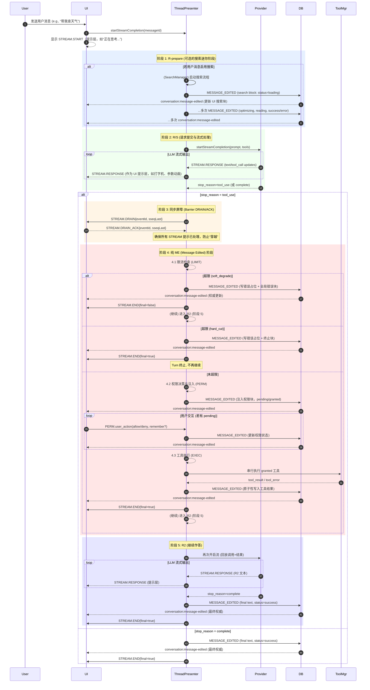

# Agent 核心工作流（端到端）

**受众：** 实施者（后端/前端/QA）、架构师、项目管理者

**指导原则：** 本文档旨在系统性地阐述 DeepChat Agent 从用户请求到最终响应的**集成化**、**端到端**工作流程。该流程严格遵循**单一真理来源 (SSoT)** 和 **阶段性同步 (Phased Synchronization)** 架构原则，以“R‑prepare → R/S → Barrier DRAIN/ACK → 纯 ME（限流/授权/执行/提交）→ R2”的生命周期顺序展开。所有描述均基于 DeepChat Agent 当前的**最终实现状态**。

---

## 1. 核心原则与背景

DeepChat Agent 的核心工作流设计旨在解决传统 Agent 系统中常见的状态不一致、用户体验割裂及调试困难等问题。为此，我们确立了以下核心原则：

*   **单一真理来源 (SSoT)：** UI 消息内容的**唯一权威更新来源**是 `CONVERSATION_EVENTS.MESSAGE_EDITED` 事件。UI 仅根据此事件携带的 `revision` 进行递增更新，确保状态永不回退。
*   **阶段性同步 (Phased Synchronization)：** 将技术交互的同步点与业务流程的阶段性强绑定。例如，`stop_reason=tool_use` 是一个关键的业务同步点，在此处引入屏障机制。
*   **UI 提示与权威状态分离：** `STREAM_EVENTS.RESPONSE` 仅用于驱动一个独立的、临时的、非持久化的 **UI Hint Layer**（如打字机效果、工具参数解析动画），绝不修改权威的消息状态。
*   **Provider “仅收集” (Collect-Only) 模式：** `LLMProviderPresenter` 仅负责收集 LLM 规划的所有工具调用，不再执行工具、不再产出 `permission-required` 事件、不再关心权限策略或 UI 授权。它在流结束时一次性返回完整的 `planned_tool_calls` 清单。
*   **`id-only` 匹配：** 所有与工具相关的块（权限块、工具结果块）与事件均以 `tool_call_id` 为唯一标识进行配对，杜绝 `name`/`timestamp` 等兜底策略。
*   **`eventId` 作为主键：** 助手消息的 `msg_id` 作为 `eventId`，贯穿整个链路，确保唯一性和可追溯性。

---

## 2. 整体时序图 (Mermaid Sequence Diagram)

以下时序图展示了一次包含工具调用的完整 Agent Turn 中，各核心组件（UI, ThreadPresenter, Provider, DB, ToolManager）之间的主要交互流程。

---

## 3. 核心流程阶段详述

### 3.1 阶段 1: R-prepare (可选的搜索迷你阶段)

*   **目的：** 在向 LLM 提交请求前，通过外部搜索增强上下文，提升回答质量和溯源性。
*   **触发：** 仅在 **首轮 R** 或消息重试（`msg_retry`）时，若用户消息包含 `search: true` 标记，则触发。后续 R2/S2 不会再次触发搜索。
*   **行为：**
    1.  TP 启动 SearchManager，执行查询重写、抓取、结果解析等子流程。
    2.  搜索的进度和结果通过多次**权威提交 (`MESSAGE_EDITED`)** 更新到 UI 上的搜索块，状态依次为 `loading` → `optimizing` → `reading` → `success/error`。
    3.  此阶段**不产生**任何 `STREAM` 事件，与后续的 S 阶段完全隔离。
    4.  搜索结果将作为上下文的一部分，用于构建最终提交给 Provider 的 Prompt。
    5.  **取消：** 在搜索过程中的任何时刻取消，都将写入取消错误块，并设置消息状态为 `error`。
*   **相关文档：** `workflows/search.md`
*   **关键审计日志：** `SEARCH.begin`, `SEARCH.rewrite_scope`, `SEARCH.rewrite_result`, `SEARCH.reading`, `SEARCH.success`, `SEARCH.error`, `SEARCH.attachment_saved`。

### 3.2 阶段 2: R/S (请求提交与流式处理)

*   **目的：** 将构建好的 Prompt 提交给 LLM，并以流式方式接收和展示模型的初步响应（文本、工具调用意图）。
*   **行为：**
    1.  TP 调用 `LLMProviderPresenter` 开启 LLM 流式生成。
    2.  `LLMProviderPresenter` 在 **“仅收集 (Collect-Only)”** 模式下工作：它解析 LLM 的 `tool_calls` 意图，但**不执行**，仅在内存中收集 `planned_tool_calls`。
    3.  TP 实时接收 `LLMProviderPresenter` 的流式事件（文本增量、工具参数增量等），并附加上 `sseq`（序列号），然后作为 `STREAM.RESPONSE` 事件转发给 UI。
    4.  UI 收到 `STREAM.RESPONSE` 后，**仅更新临时提示层 (UI Hint Layer)**，例如展示打字机效果、工具参数填充动画。UI 绝不根据 `STREAM` 事件修改权威的消息状态。
*   **关键审计日志：** `STREAM.start`, `PROVIDER.stop_reason` (`tool_use` 或 `complete`)。

### 3.3 阶段 3: 同步屏障 (Barrier DRAIN/ACK)

*   **目的：** 在 `stop_reason=tool_use` 发生时，强制同步 UI 和主进程，确保所有在途的 `STREAM` 提示都已被 UI 处理完毕，防止它们“穿越”并覆盖后续的权威提交。这是实现 SSoT 的关键机制。
*   **机制：**
    1.  TP 收到 `stop_reason=tool_use` 后，**立即停止转发新的 `STREAM.RESPONSE` 事件**。
    2.  TP 向 UI 发送 `STREAM.DRAIN` 事件，其中包含 S 阶段最后一帧的序列号 `sseqLast`。
    3.  TP `await` 等待 UI 回复 `STREAM.DRAIN_ACK`。此等待有**短超时机制**（例如 300ms），超时后 TP 将继续执行，保证流程不被卡死。
    4.  UI 收到 `STREAM.DRAIN` 后，检查其 `lastReceivedSeq` 是否大于等于 `sseqLast`，若满足则立即回复 `STREAM.DRAIN_ACK`。
    5.  屏障建立期间，TP 内部会设置一个“门控 (gate)”，暂停所有后续的权威提交，直到 ACK 收到或超时。
*   **取消：** 在屏障等待期间用户取消，将立即终止等待，并进入取消流程。
*   **多窗口兼容：** `DRAIN` 事件广播，任一窗口回复 `ACK` 即可解除屏障（TP 会去重，首个有效 ACK 生效）。
*   **关键审计日志：** `BARRIER.sent`, `BARRIER.ack` / `BARRIER.timeout`, `BARRIER.gate_on`。

### 3.4 阶段 4: 纯 ME (Message Edited) 阶段

*   **目的：** 在同步屏障后，集中处理所有需要**权威落库**的业务逻辑，包括限流、权限决策与注入、工具执行。此阶段所有对 UI 的状态更新都通过 `MESSAGE_EDITED` 事件完成，**不再有 `STREAM` 事件**。
*   **核心模块：** `ThreadPresenter` 统一协调 `ToolManager` 和 `MessageManager`。

#### 3.4.1 限流检查 (LIMIT)

*   **时机：** 屏障解除后，TP 首先对 Provider 收集到的 `planned_tool_calls` 进行限流检查。
*   **机制：**
    *   **计数口径：** 配额是“单条助手消息（`eventId`）跨阶段累计”的，按“计划调用数”计入。
    *   **`soft_degrade` (默认模式)：**
        *   TP 为本批所有 `planned` 工具写入 `{ ok:false, error:'tool_call_limit_exceeded', ... }` 错误占位符。
        *   TP 追加一个全局错误块（`common.error.toolCallLimitExceeded`），通过 `MESSAGE_EDITED` 提交。
        *   `STREAM.END` 的 `final` 标记为 `false`，表示 Turn 仍可继续，让模型知晓超限并作出回应。
    *   **`hard_cut` (可选模式)：**
        *   TP 为本批所有 `planned` 工具写入 `{ ok:false, error:'tool_call_limit_turn_terminated', ... }` 错误占位符。
        *   TP 追加一个全局终止错误块（`common.error.toolCallLimitTurnTerminated`），将消息状态设为 `error`。通过 `MESSAGE_EDITED` 提交。
        *   `STREAM.END` 的 `final` 标记为 `true`，表示 Turn 终止，不再继续。
*   **相关文档：** `workflows/max-tool-calls.md`
*   **关键审计日志：** `LIMIT.soft_degrade` / `LIMIT.hard_cut`。

#### 3.4.2 权限决策与注入 (PERM)

*   **时机：** 限流检查通过后，TP 对 `planned_tool_calls` 进行权限决策。
*   **机制：**
    1.  TP 调用 `ToolManager` 内的 **Auth Decider** 对每个工具进行权限预判，给出 `AUTO_GRANT`, `AUTO_DENY`, `REQUIRE_USER_PERMISSION` 决策。
    2.  TP 将生成的权限块（`pending`, `granted`, `denied`）通过一次 `MESSAGE_EDITED` 注入到消息中。UI 接收到权威更新后，展示待处理的权限块。
    3.  用户在 UI 上的“允许/拒绝”操作触发 `PERM.user_action` 事件，TP 接收后更新权限状态，并通过 `MESSAGE_EDITED` 再次提交。
    4.  **L1/L2 安全架构集成：** 权限决策阶段会与 L1 语义权限系统（确定性分类器）交互，确保 LLM 无法通过误报 `action` 类型绕过权限。
*   **相关文档：** `workflows/agent-security.md`
*   **关键审计日志：** `PERM.plan`, `PERM.inject`, `PERM.user_action`, `PERM.persist`, `PERM.status`, `PERM.decide`。

#### 3.4.3 工具执行 (EXEC)

*   **时机：** 当所有权限都处理完毕（无 `pending` 项）且至少有一个 `granted` 工具时，TP 开始执行工具。
*   **机制：**
    1.  TP 筛选出所有 `status === 'granted'` 的工具调用，并**按照 LLM 原始规划的顺序进行串行执行**。
    2.  TP 调用 `ToolManager` 执行工具。`ToolManager` 会与 L2 内核级物理守护系统（`rbash`, `AppArmor` 等）交互，确保执行的安全性和沙盒隔离。
    3.  每个工具执行完毕后，其结果（成功或失败）都通过一次**原子性的 `MESSAGE_EDITED`** 写入 DB 并通知 UI。如果 L2 物理层判定权限不足，将直接返回错误，不会回退权限块为 `pending`。
*   **取消：** 在工具执行期间取消，未完成的工具将写入 `user_cancelled` 错误占位。
*   **关键审计日志：** `EXEC.tool_start`, `EXEC.tool_result`, `EXEC.tool_error`。

#### 3.4.4 阶段总结 (ME Phase Conclusion)

*   在所有限流、权限、工具执行操作完成后，TP 会记录 `BARRIER.gate_off`，表示门控解除。
*   最后，TP 发送 `STREAM.END` 事件，其唯一作用是**清理 UI 提示层**。`final` 标记（`true` 或 `false`）决定了 UI 是否应解除“生成中”的状态。

### 3.5 阶段 5: R2 (Continuation / Iteration)

*   **目的：** 在工具执行后，让模型基于执行结果继续生成连贯的回答，或进行多轮工具调用。
*   **触发：** 在纯 ME 阶段结束后，若流程未被 `hard_cut` 模式中断，且无待处理的 `pending` 权限，则自动触发。
*   **机制：**
    1.  TP 构建新的上下文，**强制注入**上一阶段的“工具调用 + 工具结果”配对信息。
    2.  在计算上下文长度时，会为这些注入内容**预留 Token 预算**，防止因上下文超长导致重要信息被截断。
    3.  TP 调用 Provider 再次开启流式生成（流程回到阶段 2）。
    4.  **循环终止：** 循环会持续进行，直到 LLM 不再规划新的工具调用（`stop_reason=complete`），或达到全局最大工具调用数上限（`MAX_TOOL_CALLS`），或用户显式取消。
*   **关键审计日志：** `EXEC.continue_start`, `EXEC.context_mode`, `EXEC.context_pick`, `EXEC.budget`, `EXEC.supports_fc`, `EXEC.context_summary`。

---

## 4. 跨流程机制

### 4.1 取消机制 (ACE)

*   **概述：** DeepChat Agent 实现了统一的 ACE (Abort → Commit → End) 取消模型，确保在任何阶段都能快速、安全地终止 Agent 流程。
*   **行为：**
    1.  **Abort：** 用户点击取消，TP 立即设置取消标志，并向 Provider/SearchManager/ToolExec 发出停止指令，并设置逻辑围栏 (`revFence`, `sseqFence`) 隔离后续帧。
    2.  **Commit：** TP 通过一次**权威提交 (`MESSAGE_EDITED`)** 写入“用户已取消”的错误块，并将消息状态设为 `error`。对于执行中的工具，写入 `user_cancelled` 错误占位。
    3.  **End：** TP 发送 `STREAM.END{final=true}` 来清理 UI 提示层并结束 Turn。
*   **相关文档：** `workflows/cancellation.md`
*   **关键审计日志：** `CANCEL.start`, `CANCEL.done`, `END.sent`。

### 4.2 Agent 安全架构 (L1/L2)

*   **概述：** DeepChat Agent 采用纵深防御模型，解耦为 L1 语义权限系统和 L2 内核级物理守护系统，以保障 Agent 的安全执行。
*   **集成点：**
    *   **L1 (语义权限)：** 在纯 ME 阶段的权限决策环节，`Auth Decider` 会结合 L1 的确定性动作分类器，审计 Agent 的高级别意图（`Inspect`, `Read`, `Write`, `Network`），并依据策略 (`AUTOGRANT`, `AUTODENY`, `CONFIRM`) 进行决策。
    *   **L2 (物理守护)：** 在工具执行环节，`ToolManager` 通过无 `shell` 执行器和 `rbash + AppArmor` 沙盒环境，严格限制 Agent 的实际操作，杜绝命令注入。
    *   **桥接：** 通过“启动时交底 + 基于退出码的可靠 JIT-Refresh”解决 Agent 能力发现和上下文遗忘问题。
*   **相关文档：** `workflows/agent-security.md`

---

## 5. 关键不变量 (验收核心)

这些不变量是 DeepChat Agent 架构正确性和鲁棒性的基石，也是测试和排查问题的核心依据。

*   **SSoT 不变量：** `MESSAGE_EDITED` 总是先于 `STREAM.END` 发送。UI 的权威内容**只能**由 `MESSAGE_EDITED` 驱动更新，绝不能由 `STREAM` 事件直接修改持久化状态。
*   **屏障不变量：** `STREAM.DRAIN` 发出后，直到 `STREAM.END` 之前，TP 不会再转发任何 `STREAM.RESPONSE` 事件。这确保了 STREAM 提示不会“穿越”权威提交。
*   **状态不变量：** `STREAM` 事件绝不能将一个已处于 `success` 或 `error` 状态的块回退到 `loading`。UI 合并逻辑（若有）必须严格遵守 `revision` 递增原则。
*   **终结不变量：** 只有 `STREAM.END` 事件的 `final=true` 标记才能最终解除 UI 的“生成中”状态。`final=false` 仅表示阶段性结束，但 Turn 仍活跃。
*   **取消不变量：** 取消块恰一次；消息 `status='error'`；取消后不再推进（无 R2/S2）；工具后到结果全部丢弃；权限交互禁用。

---

## 6. 审计日志与调试点

DeepChat Agent 提供了详细的审计日志（Audit LOG）和 IO 日志（IO LOG），用于调试、排障和回放。

*   **统一字段：** 所有日志记录均包含 `ts` (时间戳) 和 `eventId` (助手消息 `messageId`)。
*   **核心审计日志标签：**
    *   `STREAM.*`: `STREAM.start`, `STREAM.end`, `STREAM.iteration`
    *   `BARRIER.*`: `BARRIER.sent`, `BARRIER.ack`, `BARRIER.timeout`, `BARRIER.gate_on`, `BARRIER.gate_off`, `BARRIER.cancelled`
    *   `ME.*`: `ME.emit`, `ME.finalize`
    *   `LIMIT.*`: `LIMIT.soft_degrade`, `LIMIT.hard_cut`
    *   `PERM.*`: `PERM.plan`, `PERM.inject`, `PERM.user_action`, `PERM.persist`, `PERM.status`, `PERM.decide`
    *   `EXEC.*`: `EXEC.tool_start`, `EXEC.tool_result`, `EXEC.tool_error`, `EXEC.continue_start`, `EXEC.continue_end`, `EXEC.context_summary`
    *   `SEARCH.*`: `SEARCH.begin`, `SEARCH.rewrite_result`, `SEARCH.success`, `SEARCH.error`
    *   `CANCEL.*`: `CANCEL.start`, `CANCEL.done`, `CANCEL.end_fallback_used`
    *   `PROVIDER.*`: `PROVIDER.stop_reason`, `PROVIDER.usage_agg`, `PROVIDER.error`
*   **IO 日志：** 详细记录 LLM 和工具的原始请求/响应/帧信息，可用于深度调试（需开启 `LOG_IO_DETAIL=true`）。
*   **相关文档：** `overview/logging-spec.md`

---

## 7. 代码参考

*   **核心调度与屏障机制：** `src/main/presenter/threadPresenter/index.ts`
*   **Provider "Collect-Only" 实现：** `src/main/presenter/llmProviderPresenter/index.ts`
*   **Auth Decider 与 ToolManager：** `src/main/presenter/mcpPresenter/toolManager.ts`
*   **消息持久化：** `src/main/presenter/threadPresenter/messageManager.ts`
*   **搜索迷你阶段：** `src/main/presenter/threadPresenter/searchManager.ts`
*   **日志系统：** `src/main/logger/audit.ts`, `src/main/logger/io.ts`
*   **事件与类型定义：** `src/shared/types/core/agent-events.ts`, `src/shared/types/core/chat.ts`
*   **渲染层状态管理：** `src/renderer/src/stores/chat.ts`
