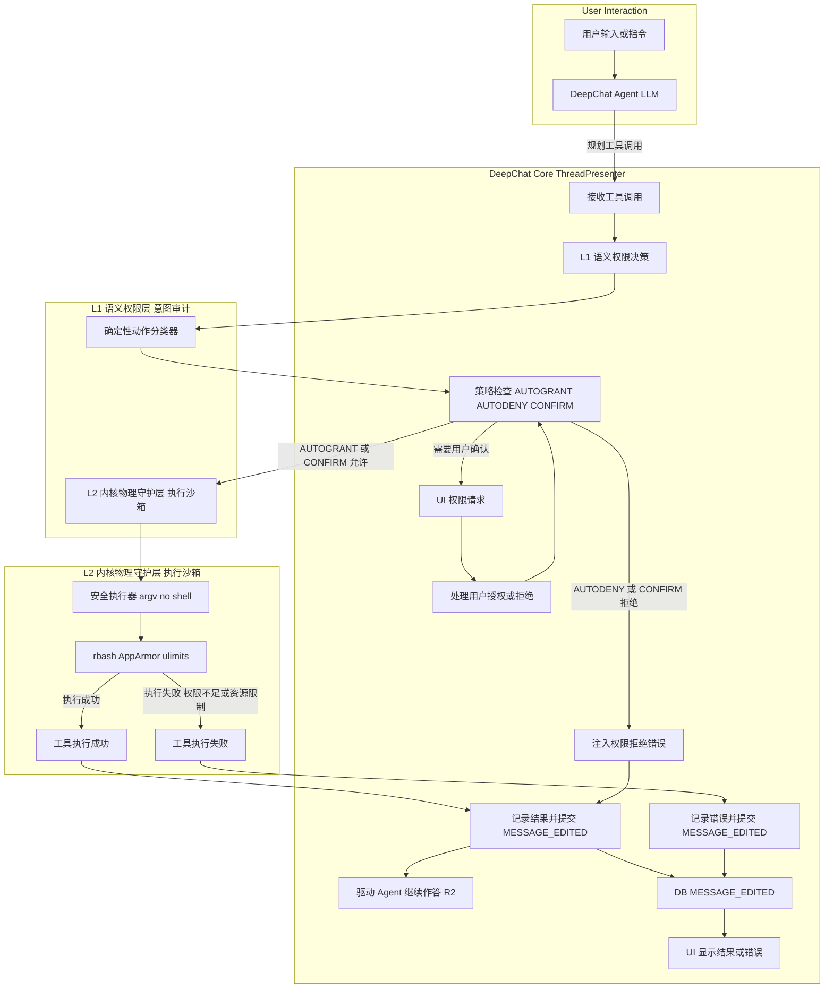

# **DeepChat Agent 安全架构 (v2.0)**

**文档目的：** 本文档旨在为 DeepChat Agent 设计并阐述一套健壮、可落地、且与 DeepChat 现有工作流无缝集成的安全架构。该架构通过“纵深防御”模型，将安全职责解耦为 **L1 语义权限层** 和 **L2 内核物理守护层**，以应对 Agent 自主性带来的系统损坏、数据泄露和非授权操作等核心风险。

**版本：** 2.0 (整合 DeepChat Step 0-4 成果与 Step 5 规划)

**最后修订：** 2025-11-15

---

## **1. 背景与核心挑战**

DeepChat Agent 的核心价值在于其理解用户意图、自主规划并执行任务的能力。然而，这种自主性在缺乏有效安全控制时，可能带来以下严峻挑战：

*   **系统损坏风险：** 恶意的提示注入（Prompt Injection）或 Agent 的“幻觉”可能导致执行破坏性命令（如 `rm -rf /`）。
*   **数据泄露风险：** Agent 可能在未经授权的情况下读取敏感文件（如 `/etc/passwd`）或通过网络将内部数据外泄。
*   **非授权操作风险：** Agent 可能执行超出用户预期或权限范围的操作，例如在错误的位置创建文件、修改系统配置或进行高成本的 API 调用。
*   **资源滥用：** 恶意或失控的 Agent 可能通过无限循环调用工具，耗尽系统资源或产生高额费用。

因此，我们需要一个既能保障系统安全，又不因过度限制而扼杀 Agent 效能的安全框架。

## **2. 核心设计原则**

本安全架构遵循以下核心原则，这些原则与 DeepChat 的整体架构原则（如 SSoT, Phased Sync）紧密结合：

1.  **纵深防御 (Defense in Depth)：** 不依赖单一安全措施。通过 L1 和 L2 两层独立的防御体系，即使一层被绕过，另一层仍能提供保护。
2.  **最小权限原则 (Principle of Least Privilege)：** Agent 的运行环境（L2）只应拥有完成其任务所必需的最小权限集合。
3.  **信任但验证 (Trust, but Verify)：** 我们信任 LLM 作为“大脑”进行任务规划，但必须在执行前通过确定性规则（L1）验证其“意图”，并通过物理沙盒（L2）约束其“行为”。
4.  **明确的职责边界：**
    *   **L1 语义权限层：** 负责理解 Agent **“想做什么”**（意图），保护**用户价值**，其决策通过 DeepChat 的 SSoT 机制（`MESSAGE_EDITED`）进行权威传播。
    *   **L2 内核物理守护层：** 负责限制 Agent **“能做什么”**（能力），保护**系统安全**，其执行结果通过 `EXEC.tool_result` 或 `EXEC.tool_error` 审计日志体现。
5.  **与核心工作流无缝集成：** 安全检查必须无缝融入 `workflows/agent-core-flow.md` 中定义的 Agent 工作流，特别是“纯 ME 阶段”，确保安全检查发生在关键的业务边界同步点。
6.  **可观测性与审计：** 所有的安全决策、拒绝原因和执行结果都必须通过 `overview/logging-spec.md` 定义的日志系统进行记录，便于排查和审计。

## **3. 整体架构：双层防御模型**

一个工具调用请求从 Agent (LLM) 发出到最终在操作系统中执行，将依次流经 DeepChat 的 ThreadPresenter、L1 语义权限层和 L2 内核物理守护层。



## **4. L1：语义权限层 (The Semantic Layer)**

**职责：** 在 DeepChat Agent 的“纯 ME 阶段”（由 `ThreadPresenter` 协调），对 Agent (LLM) 规划的每个工具调用进行意图审计和策略判断。这是防止 Agent “好心办坏事”或被提示注入欺骗的第一道防线。

### **4.1. 动作空间 (Action Space)**

我们定义一个最小且完备的四动作空间，以简化用户理解和避免“确认疲劳”：

*   **`inspect` (检查状态):** 无害的只读操作，用于获取系统元数据。
    *   **示例命令：** `ls`, `pwd`, `ps`, `df`, `date`, `whoami`
    *   **风险等级：** 极低。
*   **`read` (读取内容):** 可能涉及敏感信息的读取操作，特指查看文件**内部**内容。
    *   **示例命令：** `cat`, `head`, `tail`, `grep`, `less`
    *   **风险等级：** 高（数据泄露）。
*   **`write` (修改状态):** 任何可能创建、修改或删除文件/目录的操作。
    *   **示例命令：** `rm`, `touch`, `mkdir`, `mv`, `cp`, `echo >`, `tee`
    *   **风险等级：** 极高（系统损坏、数据丢失）。
*   **`network` (访问网络):** 任何涉及网络通信的操作。
    *   **示例命令：** `curl`, `wget`, `ping`, `ssh`
    *   **风险等级：** 高（SSRF、数据外泄）。

### **4.2. 策略空间 (Policy Space)**

针对以上四个动作，系统提供三种策略选项，可在 `ToolManager` 中进行配置和应用：

*   **`AUTOGRANT` (自动批准):** 无需用户干预，直接进入 L2 执行。
    *   **建议默认值：** `inspect`。
*   **`AUTODENY` (自动拒绝):** 直接拒绝，不进入 L2，并向 Agent 返回权限错误。
    *   **建议默认值：** `network` (在引入网络代理前，此为最具性价比的安全措施)。
*   **`CONFIRM` (人工确认):** 在 UI 弹出“权限块”，等待用户明确授权或拒绝。
    *   **建议默认值：** `read`, `write`。

### **4.3. 权限决策流程 (Auth Decider)**

这是 L1 的核心逻辑，内聚在 `src/main/presenter/mcpPresenter/toolManager.ts` 中。它遵循一个严格的、多级的决策链来判断每个工具调用的权限，并与 DeepChat 的 Phased Sync 机制紧密结合，在 `ThreadPresenter` 的“纯 ME 阶段”进行决策。

1.  **LLM 显式声明（最高优先级）：**
    *   检查工具调用的参数中是否包含 `required_permission` 字段（例如，`{"command": "ls -la", "required_permission": "read"}`）。
    *   如果存在，系统将**优先采纳**此显式声明作为 Agent 的意图。
    *   **日志：** 记录 `PERM.decide { decision:'LLM_SUGGESTED', required:'read/write/all' }`。

2.  **确定性动作分类器（强制验证）：**
    *   为了防止 LLM 被提示注入欺骗（例如，声明 `inspect` 但命令是 `rm -rf /`），系统会运行一个**极简的、确定性的分类器**。
    *   该分类器**不信任 LLM 的 `action` 字段**，而是**只检查**命令的第一个词（即二进制名称）或核心操作符。
    *   使用一个内部 `Map` 或 `switch` 语句，将二进制名称强制映射到正确的动作空间（例如，`rm` -> `write`, `cat` -> `read`）。
    *   **审计与告警：** 如果 LLM 声明的权限与分类器判定的不一致，**必须记录一条高优先级告警日志**（例如 `PERM.classification_mismatch { claimed: 'inspect', actual: 'write', command: '...' }`），表明可能存在欺骗尝试。
    *   **决策覆盖：** 分类器判定的“真实动作”将**覆盖** LLM 的原始声明，作为后续策略判断的依据。

3.  **用户持久化授权检查：**
    *   检查用户是否已通过“记住此选择”功能，为该工具（`server+tool` 粒度）配置了 `toolsAutoApprove` 策略。此配置持久化在 `MCPServerConfig` 中。
    *   如果命中，则应用用户设定的策略 (`AUTOGRANT` 或 `AUTODENY`)。
    *   **日志：** 记录 `PERM.decide { decision:'USER_REMEMBERED', scope:'server/tool', perm:'read/write/all' }`。

4.  **默认策略兜底：**
    *   如果以上步骤均未得出明确结论，则应用该动作空间的**默认策略**（例如，`write` 默认为 `CONFIRM`）。
    *   **日志：** 记录 `PERM.decide { decision:'DEFAULT_POLICY', action:'read/write/network' }`。

### **4.4. 与 DeepChat 工作流的集成点**

*   **集成点：** L1 权限决策发生在 `workflows/agent-core-flow.md` 中定义的 **纯 ME 阶段**，具体由 `ThreadPresenter` 调用 `ToolManager.AuthDecider` 完成。
*   **UI 交互：** 当决策为 `CONFIRM` 时，`ThreadPresenter` 会将一个 `tool_call_permission` 类型的 action block 注入到助手消息中，并通过 `MESSAGE_EDITED` 事件权威地更新 UI。UI 渲染可交互的权限请求块。
*   **授权响应：** 用户在 UI 上的授权/拒绝操作，会通过 `ThreadPresenter.handlePermissionResponse` 更新权限块状态，并通过 `MESSAGE_EDITED` 再次权威提交。
*   **日志：** L1 决策过程和结果通过 `overview/logging-spec.md` 中定义的 `PERM` 类别审计日志（`PERM.plan`, `PERM.inject`, `PERM.user_action`, `PERM.persist`, `PERM.status`, `PERM.decide`, `PERM.denied`）进行全面记录。

## **5. L2：内核物理守护层 (The Kernel-Level Physical Layer)**

**职责：** L2 作为最后一道防线，通过物理隔离和强制访问控制，确保即使是“已授权”的命令也无法越界。它直接作用于 Agent 命令的执行环境。

### **5.1. 执行器安全：杜绝 Shell 注入（核心安全补丁）**

**绝对禁止**使用不安全的 Shell 执行方式，例如 `shell=True` (Python `subprocess`) 或 `bash -c "..."` (Shell 命令)。这些方式允许攻击者通过注入元字符（如 `;`, `&&`, `|`）来执行任意命令，从而绕过所有上层安全检查。

**正确实现：** DeepChat 的 Shell 工具执行器（`src/main/presenter/mcpPresenter/inMemoryServers/shellServer.ts`）必须将命令字符串**安全地解析**为一个 `argv` 数组，并使用 `execve` 系统调用模式（即 `spawn` 函数的 `shell: false` 默认行为）执行。

#### **安全执行示例 (Node.js/Electron 环境)**

```javascript
// 伪代码 (使用 Node.js `child_process.spawn` 和 shlex 库)
import { spawn } from 'child_process';
import shlex from 'shlex'; // 假设存在一个 shlex 兼容库用于安全拆分

const commandFromAgent = "ls -l '/home/mcp_agent/my documents'; rm -rf /"; // 恶意注入示例

// 1. 安全地将字符串拆分为 argv 数组
// shlex.split 会正确处理引号和特殊字符，而不是将其视为命令分隔符
const argv = shlex.split(commandFromAgent);
// -> 结果可能是 ['ls', '-l', '/home/mcp_agent/my documents;', 'rm', '-rf', '/']
// 或者 ['ls', '-l', '/home/mcp_agent/my documents', ';', 'rm', '-rf', '/']，
// 具体取决于 shlex 实现，但关键是 ';' 不再被视为 shell 指令分隔符。

// 2. 构造完整的 WSL 调用，将 argv 作为独立参数传递
// '-e' 标志会关闭 bash 的交互模式，并执行 argv 数组中的第一个元素
const wslCommand = 'wsl';
const wslArgs = ['-u', 'mcp_agent', '-e', argv[0], ...argv.slice(1)]; // argv[0] 是实际要执行的命令

// 3. 安全执行：spawn 默认 shell: false，确保了 argv 模式
const wslProcess = spawn(wslCommand, wslArgs, {
  // cwd: '/home/mcp_agent/workspace', // 可选：限制工作目录
  // detached: true, // 可选：独立进程
});

wslProcess.on('close', (code) => {
  // 检查退出码，如果 code === 127，则触发 JIT-Refresh
  // 记录执行结果到日志 EXEC.tool_result 或 EXEC.tool_error
});

// 这样，"ls; rm" 中的 ';' 不再被 Shell 解释器识别为命令分隔符。
// 即使 Agent 尝试注入恶意命令，它们也会被视为单个命令的参数，或因“命令未找到”而失败，
// 从而从根本上杜绝了命令注入攻击。
```

### **5.2. 第一道物理防线：受限 Shell (`rbash`)**

`rbash` (Restricted Bash) 提供了一个用户级的命令白名单机制，是 L2 的基础。

*   **专用用户：** 创建一个名为 `mcp_agent` 的专用系统用户，其登录 Shell 被指定为 `/bin/rbash`。
*   **路径锁定：** 锁定 `mcp_agent` 用户的 `.bash_profile` (或其他启动脚本)，强制设定其 `PATH` 环境变量为 `$HOME/safe_bin`。这意味着 `mcp_agent` 只能执行 `safe_bin` 目录中的命令。
*   **命令白名单：** 在 `/home/mcp_agent/safe_bin` 目录中，只创建指向 `/bin` 或 `/usr/bin` 下允许执行的命令的**符号链接**（例如，`ln -s /bin/ls /home/mcp_agent/safe_bin/ls`）。

### **5.3. 第二道物理防线：强制访问控制 (`AppArmor`)**

`AppArmor` (Application Armor) 提供了更细粒度的、基于路径和内核能力的强制访问控制。它在内核层面强制执行安全策略，弥补了 `rbash` 的不足（例如 `rbash` 无法阻止 `cat /etc/passwd`）。

#### **`AppArmor` 配置文件示例 (`/etc/apparmor.d/mcp_agent_profile`)**

```apparmor
#include <tunables/global>

profile mcp_agent_profile /bin/bash flags=(complain) { # rbash 底层也是 /bin/bash
  #include <abstractions/base> # 包含一些基本规则

  # 1. 资源限制 (ulimits)
  # 通过内核强制限制进程资源，防止拒绝服务攻击 (DoS) 或资源耗尽。
  rlimit as <= 1G,    # 限制虚拟内存地址空间为 1GB
  rlimit cpu <= 300,  # 限制 CPU 时间为 300 秒 (5分钟)，防止无限循环
  rlimit nproc <= 50, # 限制最大进程数，防止 Fork Bomb

  # 2. 文件系统访问控制
  # 默认拒绝所有写操作，只允许在明确的工作区内写入
  deny /** w, # 默认拒绝所有文件写入权限
  
  # 明确授权工作区内的读写权限
  /home/mcp_agent/workspace/ r,
  /home/mcp_agent/workspace/** rwk, # 允许读、写、锁定

  # 拒绝访问敏感系统目录，防止信息泄露和系统配置篡改
  deny /etc/** r,      # 拒绝读取 /etc 下的系统配置文件 (如 /etc/passwd)
  deny /proc/** r,     # 拒绝读取 /proc 下的进程信息和内核状态
  deny /sys/** r,      # 拒绝读取 /sys 下的设备和内核信息
  deny /dev/** r,      # 拒绝访问 /dev 下的设备文件

  # 允许必要的库和二进制文件读取，以及 safe_bin 中的命令执行
  /home/mcp_agent/safe_bin/* ix, # 允许执行 safe_bin 中的命令 (i: inherit, x: execute)
  /bin/** r,           # 允许读取 /bin 下的二进制文件
  /usr/bin/** r,       # 允许读取 /usr/bin 下的二进制文件
  /lib/** r,           # 允许读取 /lib 下的库文件
  /usr/lib/** r,       # 允许读取 /usr/lib 下的库文件

  # 3. 内核能力 (Capabilities) 限制
  # 拒绝所有内核能力，防止提权
  capability all deny,  # 拒绝所有特权操作 (如改变用户ID, 挂载文件系统等)
  deny ptrace read,     # 拒绝 ptrace 调试，防止进程间注入或信息窃取

  # 4. 网络访问控制
  # 在引入网络代理前，默认完全禁止网络访问
  deny network,         # 拒绝所有网络连接 (TCP, UDP, ICMP 等)
}
```

### **5.4. L2 执行结果的日志记录**

*   L2 执行器返回的任何结果（成功、失败、退出码）都将通过 `ThreadPresenter` 记录到 `overview/logging-spec.md` 定义的 `EXEC` 审计日志中。
*   `EXEC.tool_result` 记录成功执行，`EXEC.tool_error` 记录失败，其中包含 `tool_call_id` 和具体的错误信息，如 `error:'permission_denied'` (AppArmor 拒绝) 或 `error:'command_not_found'` (rbash 拒绝)。

## **6. 桥接 L1 与 L2：可靠的能力发现与上下文管理**

**挑战：** Agent 在长对话中会“遗忘”其能力边界（即 L2 允许的命令列表），导致其规划出无法执行的命令。传统的“一次性交底”无法应对“上下文遗忘”。

**解决方案：** DeepChat 采用“启动时交底 + 可靠的即时刷新 (JIT-Refresh)”机制，确保 Agent 始终了解其当前被允许的能力。

1.  **启动时交底 (Handoff at Startup):**
    *   在每个新会话开始时，`ThreadPresenter` 从 `ToolManager` 获取 L2 白名单命令列表（即 `rbash/safe_bin` 中的命令）。
    *   将此列表注入到初始的 System Prompt 中，明确告知 Agent 其能力边界：“你只能使用以下命令：`ls`, `cat`, `grep`, `pwd`...”。

2.  **可靠的即时刷新 (JIT-Refresh via Exit Codes):**
    *   **场景：** Agent 在长对话后“遗忘”了限制，尝试执行一个不在白名单中的命令（例如，规划使用 `tar` 命令）。
    *   **L2 响应：** L2 执行器（rbash 或 AppArmor）会拒绝该命令。例如，`rbash` 会执行失败，并返回一个**特定的退出码 `127`**（"Command not found"）。
    *   **TP 捕获与响应：**
        *   `ThreadPresenter` 在执行工具后，检查返回的退出码（`EXEC.tool_error` 日志中的信息）。
        *   如果退出码是 `127`（命令未找到），TP 会**自动触发一个 JIT-Refresh**。
        *   它会向 LLM 的上下文中注入一条**系统修正消息**（作为 `role: 'tool'` 消息的一部分），内容如下：“[系统消息]：你上一条命令 `tar` 因‘命令未找到’（退出码 127）而失败。提醒：你只能使用以下命令：`ls`, `cat`, `grep`, `pwd`... 请基于此列表重新规划。”
    *   **优势：** 这种基于**确定性退出码**的机制比解析不稳定的 `stderr` 字符串**更可靠、更稳定**，且完全自动化，能高效地帮助 Agent 从“幻觉”中恢复，减少不必要的重试和用户干预。

## **7. 与其他核心工作流的交互**

*   **取消机制 (`workflows/cancellation.md`):**
    *   如果用户在 L1 的 `CONFIRM` 阶段取消，`ThreadPresenter` 会立即终止流程，并注入“用户取消”错误块。
    *   如果在 L2 执行过程中取消，L2 执行器会尽力中止进程（若支持），并注入“用户取消”的错误占位。
*   **搜索流程 (`workflows/search.md`):**
    *   网页搜索操作本身将被 L1 归类为 `network` 动作，并根据策略（默认 `AUTODENY`）进行处理。
    *   如果允许网络搜索，搜索结果的注入也需遵循安全原则，避免将恶意内容直接用于 Agent 提示。
*   **限流策略 (`workflows/max-tool-calls.md`):**
    *   最大工具调用数限制是**数量控制**，而非安全层。它防止 Agent 尝试执行**过多**的工具，但并不判断这些工具是否“恶意”。
    *   它是 L1/L2 的**补充控制**，防止资源滥用，与安全层协同工作。

## **8. 验收清单**

本安全架构的验收将涵盖 L1 和 L2 的关键行为：

*   **执行器安全：**
    *   测试用例：尝试注入 `ls; rm -rf /` 等元字符命令。
    *   预期结果：命令执行失败，且 `rm -rf /` 部分绝不会被执行。日志中记录 `EXEC.tool_error`。
*   **L1 语义层：**
    *   **分类器验证：**
        *   测试用例：LLM 声明 `inspect`，但实际命令是 `rm a.txt`。
        *   预期结果：L1 判定为 `write` 动作，触发 `CONFIRM` 策略，UI 弹出写权限请求。审计日志记录 `PERM.classification_mismatch` 告警。
    *   **策略验证：**
        *   测试用例：执行 `ls` 命令。
        *   预期结果：L1 判定 `inspect`，`AUTOGRANT`，直接执行，无 UI 交互。
        *   测试用例：执行 `cat /home/mcp_agent/workspace/test.txt`。
        *   预期结果：L1 判定 `read`，触发 `CONFIRM`，UI 弹出读权限请求。
        *   测试用例：执行 `curl google.com`。
        *   预期结果：L1 判定 `network`，`AUTODENY`，直接拒绝，Agent 收到权限拒绝错误。
*   **L2 物理层：**
    *   **rbash 验证：**
        *   测试用例：执行一个未被符号链接到 `safe_bin` 的标准命令（如 `tar --version`）。
        *   预期结果：L2 执行失败，返回退出码 `127`。日志记录 `EXEC.tool_error`。
    *   **AppArmor 验证：**
        *   测试用例：执行 `cat /etc/passwd`。
        *   预期结果：L2 执行失败，即使 L1 授权 `read`，AppArmor 也会在内核层面拒绝。日志记录 `EXEC.tool_error`，错误信息指明权限不足。
        *   测试用例：在 `/home/mcp_agent/` (而非 `/workspace/`) 下创建文件。
        *   预期结果：L2 执行失败。
        *   测试用例：执行 `ping google.com`。
        *   预期结果：L2 执行失败，AppArmor 拒绝网络访问。
*   **能力发现验证 (JIT-Refresh)：**
    *   测试用例：启动新会话，确认 System Prompt 包含 L2 命令白名单。
    *   测试用例：在长对话后，引导 Agent 尝试使用一个 L2 白名单中不存在的命令。
    *   预期结果：Agent 第一次尝试失败，返回退出码 `127`。`ThreadPresenter` 捕获并注入 JIT-Refresh 消息，Agent 在 R2 阶段能收到修正提示并重新规划正确的命令。

## **9. 代码参考**

*   **L1 权限决策 (Auth Decider)：** `src/main/presenter/mcpPresenter/toolManager.ts` (`decidePermission` 函数及其内部逻辑)。
*   **L2 安全执行器 (ShellServer)：** `src/main/presenter/mcpPresenter/inMemoryServers/shellServer.ts` (命令解析与执行部分)。
*   **一次性/记住授权逻辑：** `src/main/presenter/mcpPresenter/toolManager.ts` (`grantPermission`, `tempApprovals`, `toolsAutoApprove`)。
*   **JIT-Refresh 逻辑：** `src/main/presenter/threadPresenter/index.ts` (工具执行结果处理及上下文注入)。
*   **日志记录：** `src/main/presenter/llmProviderPresenter/llmTrace.ts` 和 `src/main/presenter/threadPresenter/index.ts` (审计日志打点)。
