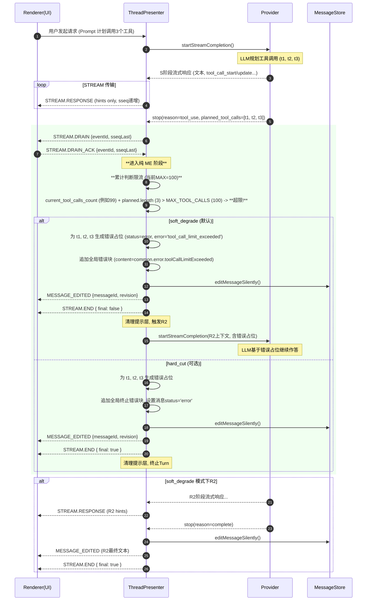

# **最大工具调用数策略 (Max Tool Calls)**

**受众：** 实施者、产品经理、QA 工程师

**指导原则：** 本文档阐述 DeepChat Agent 为防止资源滥用和无限循环而设计的最大工具调用数限制策略。核心原则是：**默认启用 `soft_degrade` 模式以保证对话连续性和模型对超限的解释能力，不引入干扰性的“配额卡”交互。由 ThreadPresenter (TP) 作为唯一的决策点进行判断、持久化和流程控制，Provider 仅负责解析和提示。**

---

## 1. 策略概述与目标

DeepChat Agent 为单条助手消息（`eventId`）在其生命周期内可以规划（`planned`）的工具调用总数设置了上限 (`MAX_TOOL_CALLS`)。当 Agent 规划的工具调用累计数量超出此上限时，系统将根据预设的模式（`soft_degrade` 或 `hard_cut`）进行干预。

此策略旨在实现以下目标：

  * **防止资源滥用：** 避免 Agent 陷入无限工具调用循环，或消耗过多 LLM API 调用资源。
  * **提供清晰反馈：** 在达到上限时，通过结构化的错误信息和自然的文本回复，向用户和 LLM 提供明确、可预测的反馈。
  * **保证对话连续性：** 默认模式 (`soft_degrade`) 允许对话在超限后继续，由 LLM 对情况进行解释。
  * **架构职责清晰：** 严格遵循 SSoT (单一真理来源) 和阶段性同步原则，将限流决策的唯一决策权完全保留在后端的协调层（TP），Provider 仅承担解析和提示的职责。

---

## 2. 核心机制与判断时机

限流机制在 Agent 核心工作流的特定节点触发，以确保时序的正确性。

  * **累计方式：**

      * 系统按 `eventId`（即单条助手消息的 ID）维度，在内存中维护一个累计计数器 `toolCallsTotal`。
      * 该计数器累加的是由模型**规划（planned）**的工具调用数量。
      * `toolCallsTotal` 的值会持久化到 `message.metadata.toolCallsTotal` 中。
      * **重要：** 计数标准按“计划调用数”计入（与授权或实际执行结论无关）。但**累加动作**发生在限流判断和权限注入**之后**。如果一个批次因为 `hard_cut` 或 `soft_degrade` 而被阻止执行，那么这批调用的数量**不会**被计入 `toolCallsTotal`。

  * **重置时机：**

      * 当一个新的 `eventId`（即新的助手消息）产生时，该计数器重置为 0。
      * 当某阶段 END 且 `planned_tool_calls` 为空时，视为该 `eventId` 的工具阶段结束，清理累计计数。

  * **判断时机（关键）：**

      * 在 Agent 的 **S 阶段（STREAM）** 结束后，即收到 `stop=tool_use` 信号时。
      * 在**同步屏障（Barrier）** 完成后（即 `STREAM.DRAIN/ACK` 机制确保 S 阶段帧已处理完毕）。
      * 在进入**纯 ME 阶段**，准备注入权限块**之前**。
      * `threadPresenter` 在此刻会汇总本阶段所有 `planned_tool_calls`，进行累计和判断：`current_tool_calls_count + 本批 planned.length > MAX_TOOL_CALLS`。

**流程中的位置概要：**
`S 阶段结束` -> `同步屏障 (DRAIN/ACK)` -> **`限流判断 (TP)`** -> `权限注入` -> **`累加计数`** -> `执行门控 (Gating)` -> `工具执行 (X)` -> `R2`

---

## 3. 默认配置与常量

  * **默认模式：** `soft_degrade` (软降级)。
  * **切换方式：** 通过修改 `threadPresenter` 内部的 `TOOL_CALL_LIMIT_MODE` 常量来切换为 `hard_cut`。
  * **当前上限值：** `MAX_TOOL_CALLS = 100`（定义于 `llmProviderPresenter/baseProvider.ts`）。

---

## 4. 模式详述

DeepChat Agent 支持两种限流模式：`soft_degrade` (默认) 和 `hard_cut` (可选)。

### 4.1. `soft_degrade` (默认模式：软降级)

此模式优先保证对话的**连续性**和 Agent 的**可解释性**。

  * **行为 (Behavior):**

    1.  当检测到 `toolCallsTotal + 本批 planned 数量 > MAX_TOOL_CALLS` 时，触发 `soft_degrade`。
    2.  TP **不会**执行本批次任何超出限额的 `planned_tool_calls`。
    3.  取而代之，TP 会为本批次中**每一个**超限的 `planned_tool_calls` 生成并持久化一个**“错误占位”**的工具结果。
    4.  同时，TP 会向消息内容中追加一个**全局的、非中断性**的错误块。
    5.  完成上述 `MESSAGE_EDITED` 提交后，TP 会发送 `STREAM.END { final: false }`，并正常触发 **R2（继续作答）** 流程（通过调用 `continueAfterAllDenied`）。
    6.  在 R2 阶段，如果模型继续规划工具调用（且仍超出限额），TP 将继续为这些调用生成错误占位，直到模型停止规划工具。

  * **用户体验 (User Experience):**

      * 用户会看到所有超限的工具块立即显示为错误状态（带有错误信息）。
      * 消息末尾会出现一条全局错误提示，告知已达上限，但对话会继续。
      * Agent 会继续生成文本（R2），通常会基于看到的错误占位进行解释和总结，例如：“我已经达到了本轮的工具调用上限，因此无法执行 xxx 操作。请问还有什么其他可以帮助您的吗？”

  * **设计动机 (Design Rationale):**

      * 通过错误占位将“超限”这一事实明确暴露给模型，引导其在 R2 阶段产出可理解的自然语言总结，避免对话突然中断。
      * 避免了引入复杂的“配额卡”交互，减少对用户主任务流程的干扰。

  * **审计日志示例 (Audit Log Example):**

    ```json
    {"ts":1762883303000,"eventId":"EVT456","kind":"LIMIT","action":"soft_degrade","limit":100,"prev":99,"batch":2}
    {"ts":1762883303050,"eventId":"EVT456","kind":"STREAM","action":"end","final":false}
    {"ts":1762883303100,"eventId":"EVT456","kind":"EXEC","action":"continue_start"}
    ```

    (注意：`limit` 是 `MAX_TOOL_CALLS`，`prev` 是 `toolCallsTotal` 累计值，`batch` 是本批 `planned` 数量)

### 4.2. `hard_cut` (可选模式：硬性中断)

此模式优先保证**资源节约**和**严格控制**。

  * **行为 (Behavior):**

    1.  当检测到超限时，触发 `hard_cut`。
    2.  TP 会为本批次的**每一个**超限的 `planned_tool_calls` 生成并持久化一个**“错误占位”**的工具结果。
    3.  同时，TP 会向消息内容中追加一个**终止性**的全局错误块，并将该助手消息的整体状态（`status`）置为 `error`。
    4.  完成上述 `MESSAGE_EDITED` 提交后，TP 会发送 `STREAM.END { final: true }`，**并立即终止当前 Turn，不再进入 R2**。

  * **用户体验 (User Experience):**

      * 用户会看到超限的工具块变为错误状态，并收到一条明确的“回合终止”提示。
      * Agent 的生成过程完全停止，对话在此消息处终结，等待用户发起新的指令。

  * **设计动机 (Design Rationale):**

      * 在达到上限时立即终止所有活动，防止任何进一步的资源消耗。适用于对成本敏感或需要严格执行限制的场景（如批处理、自动化脚本）。

  * **审计日志示例 (Audit Log Example):**

    ```json
    {"ts":1762883304000,"eventId":"EVT457","kind":"LIMIT","action":"hard_cut","limit":100,"prev":99,"batch":2}
    {"ts":1762883304050,"eventId":"EVT457","kind":"STREAM","action":"end","final":true}
    ```

---

## 5. 职责边界与 Provider 行为

在最大工具调用数策略中，Provider 和 ThreadPresenter (TP) 的职责划分至关重要。

  * **Provider (LLMProviderPresenter - Collect-Only):**

      * **职责：** 严格遵守“仅收集 (Collect-Only)”模式。
      * **行为：** 仅负责解析和收集 `planned_tool_calls`，并在 `END` 事件和 IO 聚合日志中体现。
      * **重要：** Provider **不执行、不授权、不过问配额**。Provider 曾有的硬性限制机制，已按“Provider 软提示、TP 权威裁决”的原则迁移，即 Provider 不再以“达到 MAX 直接 break”的方式中止流。它可能会输出 `maximum_tool_calls_reached` 或 `quota_hint` 供 TP 审计，但**不会中断流**。

  * **协调层 (ThreadPresenter - TP):**

      * **职责：** 作为限流策略的**唯一决策点**。
      * **行为：** 在同步屏障后，进行 `toolCallsTotal` 累计判断，根据模式（`soft_degrade` / `hard_cut`）写入错误占位和全局错误块，更新 `message.status`，控制 `END` 事件的 `final` 标志，并最终决定是否触发 R2 或终止 Turn。

---

## 6. UI 交互与错误呈现

由于策略不包含用户交互式“配额卡”，UI 的呈现主要通过 `MESSAGE_EDITED` 事件传递的消息块来驱动。

  * **全局错误块 (通过 `MESSAGE_EDITED` 提交):**

      * **目的：** 向用户提供清晰的全局性提示。
      * **结构：** `{ type:'error', content:'<i18n_key>', status:'error' }`
      * **i18n 键 (参考 `step-4/plan.md`):**
          * **标题 (统一)：** `common.error.toolCallLimitTitle`
              * zh-CN: "已达工具调用上限"
              * en-US: "Tool call limit reached"
          * **`soft_degrade` 模式内容：** `common.error.toolCallLimitExceeded`
              * zh-CN: "已超过工具调用上限，回合将继续，但后续调用会返回超限错误。"
              * en-US: "Limit exceeded; subsequent tool calls will return error placeholders."
          * **`hard_cut` 模式内容：** `common.error.toolCallLimitTurnTerminated`
              * zh-CN: "已达到工具调用上限，本回合已终止。"
              * en-US: "Tool call limit reached; this turn has been terminated."

  * **工具错误占位 (通过 `MESSAGE_EDITED` 提交):**

      * **目的：** 明确指出每个超限工具调用未被执行。
      * **结构：** 每个超限的 `tool_call` 块的 `response` 字段会被写入一个标准的错误对象：
        ```json
        {
          "ok": false,
          "error": "tool_call_limit_exceeded", // 或其他特定错误码
          "message": "<i18n_key>" // 人类可读的错误信息
        }
        ```
      * **i18n 键 (参考 `step-4/plan.md`):**
          * **`soft_degrade` 模式内容：**
              * zh-CN: "已超过工具调用上限，后续工具调用将返回错误占位。请停止当前轮次函数调用，稍后重试。"
              * en-US: "Limit exceeded. Subsequent tool calls will return error placeholders. Please stop current round and try again later."
          * **`hard_cut` 模式内容：**
              * zh-CN: "已超过工具调用上限，回合终止。请停止当前轮次工具调用，稍后重试。"
              * en-US: "Limit exceeded and the turn is terminated. Please stop tool calls for this round and try again later."

  * **流式提示 (STREAM Hint):**

      * 系统**可以**在检测到超限时发送一个临时的 STREAM 提示（例如 `maximum_tool_calls_reached`），但此提示**不会写入数据库**，且不包含交互按钮。此提示仅在 STREAM 期间显示，`END/ERROR` 后清理。最终状态严格以 `MESSAGE_EDITED` 为准。

---

## 7. 示例流程与时序图

以下时序图展示了一个 `soft_degrade` 模式下，Agent 规划的工具调用超出上限时的核心流程。



---

## 8. 代码参考

  * **限流判断与错误占位/全局错误块写入：** `src/main/presenter/threadPresenter/index.ts`
  * **`planned_tool_calls` 收集：** `src/main/presenter/llmProviderPresenter/index.ts`
  * **`MAX_TOOL_CALLS` 常量定义：** `src/main/presenter/llmProviderPresenter/baseProvider.ts`
  * **审计日志记录：** `src/main/logger/audit.ts` (基于 `logging-spec.md`)
  * **i18n 键定义：** `src/renderer/src/i18n/<lang>/common.json`

---

## 9. 验收清单

以下是针对最大工具调用数策略的关键验收点，用于验证其功能正确性、行为一致性和可观测性。

  * **环境与准备：**

      * 运行：`pnpm run dev`
      * 日志目录：`logs/audit/` (审计日志), `logs/io/` (LLM/工具 IO 详情)
      * 确保 `MAX_TOOL_CALLS` 常量值已知（默认为 100）。
      * 准备能触发超过 `MAX_TOOL_CALLS` 限制的 Prompt（例如，在单次请求中并行创建 101 个文件）。

  * **默认行为 (`soft_degrade`) 验证：**

      * [ ] **步骤：** 发送一个 Prompt，使其规划的工具调用数超过 `MAX_TOOL_CALLS`（例如，`MAX_TOOL_CALLS=2` 时，规划 3 个）。
      * [ ] **UI 预期：**
          * 所有超限的工具调用块立即显示为错误状态，带有明确的错误信息。
          * 消息中出现一条全局错误提示（i18n 键 `common.error.toolCallLimitExceeded`）。
          * Agent 能够继续生成（R2），并对工具调用未执行的情况进行解释。
      * [ ] **日志预期 (`logs/audit/`):**
          * 出现 `LIMIT.soft_degrade { limit, prev, batch }` 审计记录。
          * `STREAM.end { final: false }` 审计记录。
          * 后续有 `EXEC.continue_start` 审计记录。
      * [ ] **IO 日志预期 (`logs/io/<eventId>.json`):**
          * 相应相位中，超限的 `planned_tool_calls` 对应的 `tool_call` 元素在其 `response` 字段中包含 `{"ok":false, "error":"tool_call_limit_exceeded", ...}`。

  * **`hard_cut` 模式验证：**

      * [ ] **步骤：** 修改代码常量，将模式切换为 `hard_cut`。发送一个 Prompt，使其规划的工具调用数超过 `MAX_TOOL_CALLS`。
      * [ ] **UI 预期：**
          * 所有超限的工具调用块显示为错误状态。
          * 消息中出现一条全局终止性错误提示（i18n 键 `common.error.toolCallLimitTurnTerminated`）。
          * 该助手消息的 `status` 变为 `error`。
          * Agent 停止生成，不进入 R2。
      * [ ] **日志预期 (`logs/audit/`):**
          * 出现 `LIMIT.hard_cut { limit, prev, batch }` 审计记录。
          * `STREAM.end { final: true }` 审计记录。
          * **无** `EXEC.continue_start` 审计记录。

  * **边界条件验证：**

      * [ ] **步骤：** 规划的工具调用数**恰好等于** `MAX_TOOL_CALLS`。
      * [ ] **UI/行为预期：** 所有工具正常进入权限检查和执行流程，不触发限流。
      * [ ] **日志预期：** **不**出现 `LIMIT.*` 审计记录。

  * **Provider 职责验证：**

      * [ ] **步骤：** 观察 Provider 侧的日志或行为。
      * [ ] **预期：** Provider 不会因达到 `MAX_TOOL_CALLS` 而中断流或阻止工具调用规划。其 `planned_tool_calls` 在 `STREAM.END` 中正常上报。

  * **TP 决策验证：**

      * [ ] **步骤：** 观察 TP 侧的日志。
      * [ ] **预期：** `LIMIT.*` 审计日志由 TP 产生，且 TP 负责写入错误占位和控制 `STREAM.END` 的 `final` 标志。

  * **`MESSAGE_EDITED` 驱动 UI 验证：**

      * [ ] **步骤：** 观察 UI 在超限时的更新。
      * [ ] **预期：** UI 的错误提示和工具块状态变化，严格由 `MESSAGE_EDITED` 事件驱动，没有 STREAM 提示层导致的闪烁或不一致。