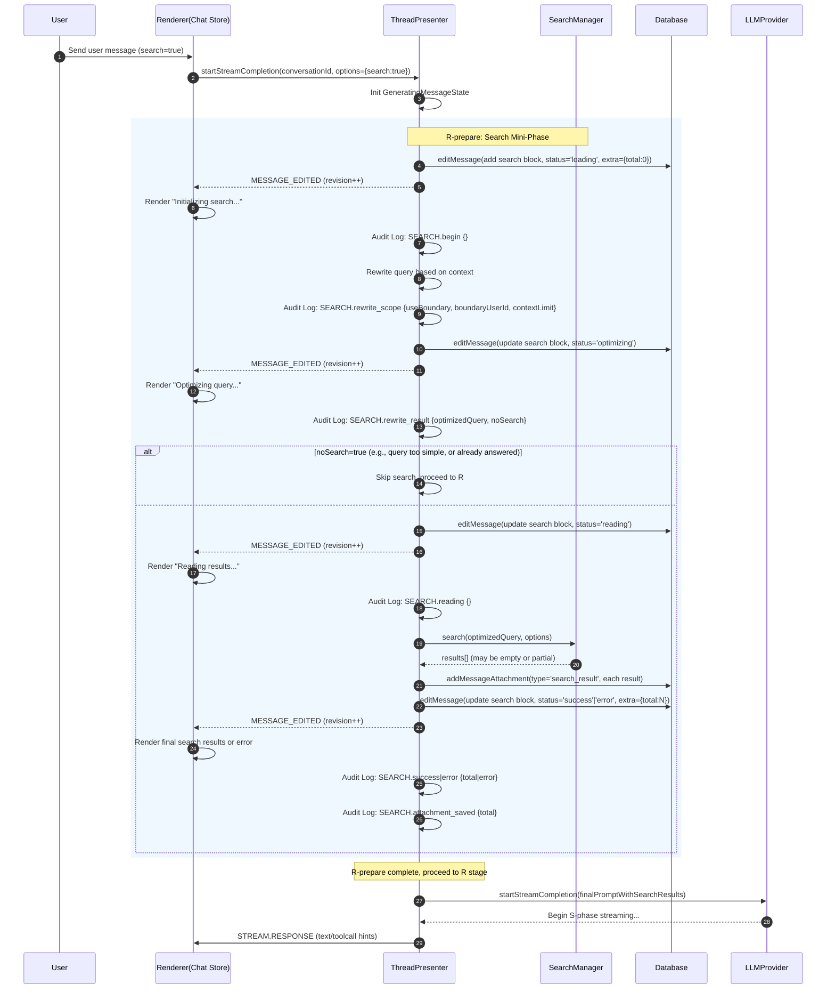

# 搜索流程 (R-prepare 迷你阶段)

**受众：** 实施者、架构师、QA 工程师、产品经理

**指导原则：** 搜索是 DeepChat Agent 核心工作流中一个独立的、高价值的**"R-prepare"迷你阶段**。它发生在向 LLM 提交请求（R 阶段）之前，旨在通过实时或最新信息补强 Prompt 输入。此阶段严格遵循**单一真理来源 (SSoT)** 原则，所有状态变更和结果都**仅**通过 `MESSAGE_EDITED` 权威提交，**不产生 STREAM 事件**，因此与 S 阶段的同步屏障机制完全解耦，确保 UI 状态的最终一致性和流程的鲁棒性。

## 1. 阶段定位与目标

在 DeepChat Agent 的工作流中，搜索功能被定位为一个**R 阶段的前置子流程**，即 **R-prepare 阶段**。其核心目标是：

*   **增强 Prompt：** 在正式向 LLM 发起请求（R 阶段）之前，基于用户查询和上下文，动态地进行网页搜索，并将高质量的检索结果（或其摘要）注入到即将提交给 LLM 的上下文中。
*   **提升质量与时效性：** 显著提升 Agent 回答的实时性、准确性、相关性。
*   **可溯源性：** 搜索结果通常包含来源链接，方便用户追溯信息源。
*   **架构解耦：** 将搜索逻辑从 LLM 的流式处理中分离，作为一个独立的、可控的子阶段。

此阶段的关键架构特征是：

*   **独立性：** 搜索在 Agent 核心循环的 S（流式）阶段**之前**执行，不与工具调用流程并发。
*   **权威驱动 (SSoT)：** 搜索过程中的所有状态更新（如“正在搜索”、“正在阅读”）都通过 `MESSAGE_EDITED` 事件进行权威提交，确保 UI 状态的最终一致性。
*   **无流式注入：** 搜索结果**绝不**通过 `STREAM_EVENTS` 回注到 UI。这从根本上避免了与 S 阶段的竞态条件，并简化了 UI 的合并逻辑。

## 2. 触发条件与策略

搜索流程的触发时机被严格限定，以确保流程的可预测性和效率，并避免不必要的资源消耗。

*   **允许触发的场景：**
    1.  **首轮 R (Initial R)：**
        *   当用户发送的第一条消息明确需要搜索时（例如，通过 UI 开关设置 `userMessage.content.search === true`）。
        *   或通过会话级设置（如 `input_webSearch`）启用时。
    2.  **消息重试 (msg_retry)：** 当用户从某条历史消息发起“重新生成”时，系统会将其视为一次新的 R-prepare 阶段，允许重新触发搜索流程。此时，搜索的上下文重写会支持“用户边界”，仅基于被重试用户消息之前的上下文，避免带入后续助手输出，从而降低“无须搜索”的早退概率。

*   **禁止触发的场景：**
    *   **R2/S2 (后续轮次)：** 在工具调用执行完毕、Agent 进入“继续作答”（R2）阶段时，**禁止**再次触发搜索。这是为了避免不必要的循环、流程复杂化和资源浪费，确保 Agent 专注于基于已知信息进行推理和总结。

*   **配置与引擎：**
    *   **选择器/引擎：** 内置多引擎模板（例如 Google/Bing/Baidu/Sogou 等），支持自定义搜索引擎配置和云端选择器配置刷新。详见 `searchManager.ts`。
    *   **上下文限制：** 搜索上下文重写时，会考虑 `contextLimit` 和 `boundaryUserId`，以优化查询。

## 3. 端到端时序与状态机

搜索迷你阶段是一个内部包含多个步骤的状态机，每个步骤都通过一次权威的 `MESSAGE_EDITED` 提交来更新 UI，并记录详细的审计日志。

### 3.1. 时序图 (Mermaid)

### 3.2. 状态机详解与审计日志

搜索迷你阶段是一个内部包含多个步骤的状态机。TP 在每个步骤结束时，通过一次权威的 `MESSAGE_EDITED` 提交来更新 UI，并记录详细的审计日志 (`kind: 'SEARCH'`)。

1.  **`begin` (开始):**
    *   **系统行为：** TP 接收到需要搜索的请求，初始化搜索流程。
    *   **权威提交：** TP 调用 `editMessage` 在消息中插入一个 `type: 'search'` 的块，初始状态为 `status: 'loading'`, `extra: { total: 0 }`。
    *   **UI 表现：** 显示搜索块的初始加载动画或文本（例如“正在初始化搜索...”）。
    *   **审计日志：** `SEARCH.begin {}`

2.  **`rewrite_scope` / `rewrite_result` (查询重写与优化):**
    *   **系统行为：** TP 基于LLMProviderPresenter的上下文选取策略 (`context_mode='search'`) 对用户原始查询进行重写，以获得更精确的搜索关键词。此步骤会考虑 `useBoundary`, `boundaryUserId`, `contextLimit` 等参数。
    *   **权威提交：** TP 更新搜索块状态为 `status: 'optimizing'`，并包含重写结果。
    *   **UI 表现：** 显示“正在优化查询...”等提示。
    *   **审计日志：** `SEARCH.rewrite_scope { useBoundary, boundaryUserId, contextLimit }`, `SEARCH.rewrite_result { optimizedQuery, noSearch }`。如果 `noSearch` 为 `true`，则直接跳过后续搜索步骤，进入 R 阶段。

3.  **`reading` (阅读中):**
    *   **系统行为：** TP 调用 `SearchManager`，使用优化后的查询，启动浏览器窗口（或直接调用 API）进行页面抓取和内容提取。 `SearchManager` 会检查 `isWindowAlive` 以避免因窗口销毁导致的错误。
    *   **权威提交：** TP 更新搜索块状态为 `status: 'reading'`。
    *   **UI 表现：** 显示“正在阅读搜索结果...”等提示，可能会展示已抓取页面的数量。
    *   **审计日志：** `SEARCH.reading {}`

4.  **`success` / `error` (完成/失败):**
    *   **系统行为：** `SearchManager` 返回所有搜索结果。
        *   **成功：** TP 将每个结果持久化到 `messages_attachments` 表中，并更新搜索块的最终状态为 `status: 'success'`, `extra: { total: N }`。
        *   **失败：** TP 更新搜索块状态为 `status: 'error'`, 记录错误信息。
    *   **权威提交：** TP 发出最终的 `MESSAGE_EDITED`。
    *   **UI 表现：** 显示完整的搜索结果列表（可点击查看详情）或清晰的错误信息。
    *   **审计日志：** `SEARCH.success { total }` 或 `SEARCH.error { error }`，以及 `SEARCH.attachment_saved { total }`。

5.  **`gate` / `gate_decision` (门控决策):**
    *   **系统行为：** 在搜索流程的某些关键点，TP 会进行门控决策，判断是否允许搜索继续或是否需要跳过。
    *   **审计日志：** `SEARCH.gate { contextMode, isRPrepare, gateAllow, userSearchFlag, willSearch, webSearchCfg }`, `SEARCH.gate_decision { gateAllow, userSearchFlag, willSearch }`。

## 4. 与 Agent 核心流程的关系

*   **架构隔离：** 搜索流程在 Agent 核心循环的 S（流式）阶段**之前**执行，不与工具调用流程并发，也不受 `stop=tool_use` 后的同步屏障（`DRAIN/ACK`）机制影响。这种解耦确保了搜索阶段的独立性和稳定性。
*   **流程衔接：** 搜索迷你阶段成功结束后，TP 会将格式化的搜索结果（通常是 Markdown 格式，包含引用编号）注入到即将提交给 LLM 的 Prompt 上下文中。随后，TP 调用 `LLMProviderPresenter.startStreamCompletion()`，正式启动 S 阶段，此时 Agent 的核心循环才真正开始。
*   **双真源规避：** 任何基于流事件（如 `tool_call_response_raw`）的搜索回注路径已被移除，确保搜索结果仅通过权威提交（`MESSAGE_EDITED`）下发，避免“双真源”问题。

## 5. 取消路径 (Cancellation Path)

搜索流程中的任意时刻都支持用户取消，并严格遵循统一的 **ACE (Abort → Commit → End)** 模型。

1.  **Abort (中止):**
    *   `ThreadPresenter` 设置内部的 `isCancelled` 标志 (`state.isCancelled=true`)。
    *   记录取消围栏 (`revFence`)。
    *   立即调用 `searchManager.stopSearch(conversationId)`，关闭所有正在运行的搜索浏览器窗口。

2.  **Commit (提交):**
    *   `ThreadPresenter` 立即对当前消息进行一次最终的权威提交：
        *   插入一个 `type: 'error', content: 'common.error.userCanceledGeneration', status:'cancel'` 的取消块。
        *   将整条消息的 `status` 设置为 `error`。
    *   通过 `MESSAGE_EDITED` 事件通知 UI。

3.  **End (结束):**
    *   由于搜索不占用 `STREAM` 通道，TP 可以选择发送一个“技术性”的 `STREAM.END` 事件，以确保 UI 层的“生成中”状态（如果有）被彻底清理。
    *   清理 `searchingMessages` 和 `generatingMessages` 中对应的状态。

## 6. 数据与持久化

*   **消息块 (Message Block):**
    *   搜索的进度和最终状态作为一个 `type: 'search'` 的块，被持久化在 `messages` 表的 `content` 字段中。
    *   UI 渲染层对搜索块的合并按 `id-only` + 更高 `revision` 幂等，确保多窗口下的一致性。
*   **搜索结果 (Search Results):**
    *   每条详细的搜索结果（包括 URL、标题、摘要、图标、正文片段等）以 JSON 格式，作为 `type: 'search_result'` 的附件，被持久化在 `messages_attachments` 表中，与主消息关联。
    *   这些附件供导出、回放和 Prompt 注入使用。
*   **Prompt 注入：** `generateSearchPrompt(query, results)` 函数将格式化后的结果（通常是 Markdown 格式，包含引用编号）注入到 LLM 的 Prompt 中。

## 7. 并发与资源管理

*   **并发搜索：** `maxConcurrentSearches` 参数（例如设置为 3）限制了同时运行的搜索窗口数量。超出限制时，系统会回收最早的搜索窗口。
*   **资源释放：** `AbortController` 与 `SearchManager.stopSearch()` 机制确保在取消或错误时，及时释放浏览器进程等资源。TP 在错误/取消路径下统一关闭相关资源。
*   **幂等合并：** 渲染端通过 `messageId + revision` 机制进行严格的幂等合并，确保多窗口下 UI 状态的一致性。

## 8. 边界与容错

*   **查询重写失败：** 如果查询重写失败，系统会降级使用原始用户查询，并记录日志。
*   **无搜索结果：** 即使搜索结果为空 (`extra.total=0`)，流程仍会继续进入 R 阶段。LLM Prompt 模板应能处理“无来源”的情况。
*   **取消中断：** 在搜索过程中的任一步骤取消，流程应立即终止，并写入取消块和 `MESSAGE_EDITED`。
*   **结果体积：** 搜索结果体积较大时，建议进行分页或摘要化提交，以避免 UI 卡顿和 Token 消耗过大（此为后续优化项）。
*   **窗口滚动竞态：** `simulatePageScrolling` 函数中包含 `isWindowAlive` 检查和安全短路机制，以应对窗口销毁导致的竞态问题。

## 9. 验收清单

*   **[ ] 权威驱动验证：** 验证搜索的所有子阶段（`loading`, `optimizing`, `reading`, `success`/`error`）都**仅通过 `MESSAGE_EDITED` 事件**更新 UI，`STREAM` 事件中**绝不**包含任何搜索结果。
*   **[ ] 状态机完整性：** 验证 UI 能够正确地按顺序展示搜索的各个子阶段状态，且状态切换平滑。
*   **[ ] 触发条件正确：** 验证搜索仅在首轮 R 和 `msg_retry` 时触发，在 R2/S2（工具调用后）**不会**触发。
*   **[ ] 取消行为一致：** 在搜索的任意子阶段点击取消，流程应立即终止，UI 准确显示取消块，并且**不会**继续进入 S 阶段。
*   **[ ] 数据持久化验证：**
    *   数据库 `messages` 表中存在 `type: 'search'` 的块，且 `status` 和 `extra` 字段正确反映最终状态。
    *   `messages_attachments` 表中存在对应的 `type: 'search_result'` 的附件，内容完整。
*   **[ ] 流程衔接：** 验证搜索成功后，Agent 能够正常进入 S 阶段，并且其上下文**明确包含了格式化的搜索结果**。
*   **[ ] 门控决策审计：** 检查审计日志中 `SEARCH.gate` 和 `SEARCH.gate_decision` 的记录，确认搜索决策逻辑正确。
*   **[ ] 异常处理：** 模拟网络失败、搜索结果为空等场景，验证系统降级处理是否得当，并确保能进入 R 提交。

## 10. 代码参考

*   **核心管理器：** `src/main/presenter/threadPresenter/searchManager.ts` (负责搜索的实际执行、窗口管理和结果抽取)
*   **流程协调与提交：** `src/main/presenter/threadPresenter/index.ts` (负责搜索迷你阶段的调度、状态机推进、`MESSAGE_EDITED` 提交和与 LLM 的衔接)
*   **数据持久化：** `src/main/presenter/sqlitePresenter/index.ts`
*   **UI 渲染：** `src/renderer/src/components/message/MessageItemAssistant.vue` (负责渲染搜索块)
*   **相关常量：** `src/main/presenter/threadPresenter/const.ts`
